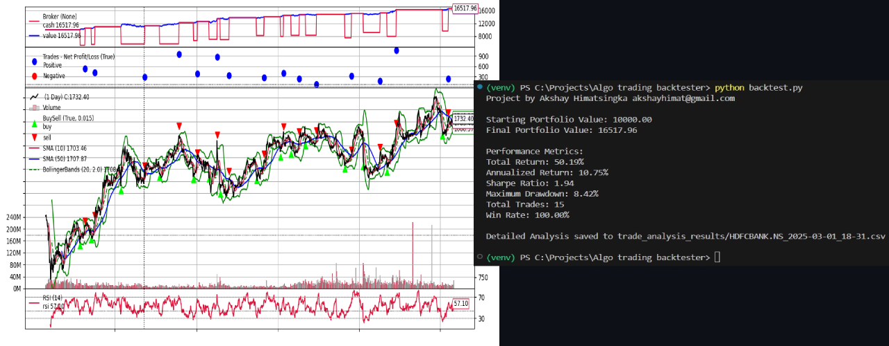

# Algorithmic Trading Backtester

A backtesting framework for algorithmic trading strategies that supports various indicators such as SMA, RSI, and Bollinger Bands. The framework also allows combining the strengths of all three indicators to generate multi-signal strategies and evaluate their performance on historical stock price data. Users can adjust risk exposure through cash allocation and stop-loss mechanisms, optimize parameters, and analyze performance metrics.

## Screenshots



## Features

- Backtest various trading strategies on any listed security of your choice
- Design highly customized and personalized trading setup tailored to your preferences and risk tolerance
- Analyze detailed csv reports for each backtest, containing comprehensive information about every trade
- Adjust risk management settings with flexible cash allocation and stop-loss mechanisms
- Modular framework for easily adding new indicators to expand functionality

## Installation

Clone the repository:

```bash
git clone https://github.com/akshayhim/Algorithmic-Trading-Backtester
```

Navigate to the project directory:

```bash
cd algorithmic-trading-backtester
```

Set up a python virtual environment and install dependencies:

```bash
python -m venv venv
source venv/bin/activate (Mac/Linux)
venv\Scripts\activate (Windows)
pip install -r requirements.txt
```

Basic run setup:

```bash
go to data_loader.py
change 'ticker' to your choice of stock's ticker on https://finance.yahoo.com/
change period to your choice (1m, 3y, 5y, etc)

go to backtest.py
change cerebro.addstrategy() to the indicator of your choice
```

Run Command (make sure you're in root directory):

```bash
python backtest.py
```

View performance metrics and detialed analysis in the terminal and the generated CSV files respectively.

## Project Structure

algorithmic-trading-backtester/  
strategies/  
sma_strategy.py  
rsi_strategy.py  
bollinger_strategy.py  
multi_signal_strategy.py

data_loader.py  
backtest.py  
requirements.txt

## Customizable Data Points for Tailored Backtesting

- In backtest.py you can tweak cerebro.addstrategy to select the indicator of your choice
- In backtest.py you can tweak cerebro.broker.set_cash & setcommission to alter initial portfolio cash and brokerage comission
- In individual stratergies files, you can alter the params to depending on your trading style (ex - Fast SMA period, RSI period, etc)
- In individual stratergies files, you can alter the risk_per_trade to decide %age of portfolio cash allocated for each trade depending on your risk apetite
- In individual stratergies files, you can alter self.stop_loss_price to change the stop-loss for each trade

## Performance Metrics

The framework provides detailed performance metrics:

- **Total Return**: Overall profit/loss of the strategy.
- **Annualized Return**: Compounded yearly return.
- **Sharpe Ratio**: Risk-adjusted return.
- **Maximum Drawdown**: Largest peak-to-trough decline.
- **Win Rate**: Percentage of profitable trades.

## License

This project is licensed under the MIT License. See `LICENSE` for details.
